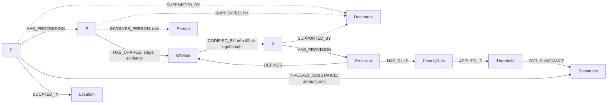

# Thiết kế Ontology — Day 19

**Họ tên:** …  **MSSV:** …

**Lựa chọn** (đánh dấu một):
- [ ] Dùng ontology gợi ý (có thể chỉnh nhỏ)
- [x] Tự thiết kế (xét bonus +15, xem `SUBMISSION.md`)

> Phạm vi bằng chứng ban đầu: Điều 251 BLHS và 3–4 bài tin được đọc để phác thảo ontology. Lúc benchmark chạy, corpus đã có đủ 18 tài liệu luật, gồm Luật PCMT Điều 2 và BLHS Điều 250, 255; vì vậy các điều trên có mặt trong graph benchmark.

## 1. Sơ đồ

`Offense` là node cầu nối ngữ nghĩa giữa tin tức và luật. `Proceeding` giữ riêng từng giai đoạn tố tụng; `PenaltyRule` và `Threshold` tách khung hình phạt khỏi điều kiện định lượng.

### Đối chiếu các thứ và quan hệ trong hai KB

| Thứ/quan hệ | KB luật | KB tin | Có ở cả hai? |
| --- | --- | --- | --- |
| Tội danh (`Offense`) | Tên tội tại Điều 251 | Tội danh/hành vi bị điều tra, truy tố hoặc xét xử | **Có** — cần chuẩn hóa để nối đúng |
| Chất ma túy (`Substance`) | Các chất nêu ở từng khoản/điểm Điều 251, như MDMA | Chất được thu giữ/vận chuyển/sử dụng, như MDMA, Ketamine, etomidate | **Có** — tên trong tin có thể là alias/từ lóng |
| Điều, khoản, điểm, khung phạt | Điều 251, các khoản 1–5 và điểm tương ứng | Không định nghĩa luật; chỉ có thể nhắc tội danh hoặc điều luật | Không |
| Người, vụ việc, giai đoạn tố tụng, địa điểm | Không có trong văn bản luật đã đọc | Bị cáo/nghi phạm, vụ án, xét xử/bắt giữ, địa danh/tòa án | Không |
| `SUPPORTED_BY` (khẳng định trích xuất được tài liệu nguồn) | Có thể trỏ về tài liệu luật | Có thể trỏ về bài báo | **Có** — quan hệ provenance chung |
| Liên kết quy định ↔ tội danh (`DEFINES`) | Khoản/điều luật mô tả tội danh | Tin nêu charge nhưng không phải định nghĩa pháp lý | **Có chung đầu mối `Offense`, không phải cùng một cạnh** |
| Liên kết khối lượng ↔ chất (`Threshold`/`INVOLVES_SUBSTANCE`) | Ngưỡng chất theo khoản/điểm | Chất và lượng tang vật/cáo buộc trong vụ việc | **Có chung `Substance`, không phải cùng một cạnh** |

## 2. Entity types (node labels)

`doc_id` trên các node trích từ một tài liệu là ID nguồn bắt buộc để truy vết. Các khóa dưới đây là khóa `MERGE`/unique; không dùng tên tự do của LLM làm khóa toàn cục.

| Label | Ý nghĩa | Khóa định danh (`MERGE` theo) | Properties | Lấy từ KB nào | Trích bằng (regex / LLM / khác) |
| --- | --- | --- | --- | --- | --- |
| `Document` | Tài liệu nguồn | `doc_id` từ front matter | `kb`, `title`, `source_url`, `document_version` | Luật và tin | Metadata/khác: đọc front matter |
| `CaseEvent` | Vụ việc được bài báo tường thuật | `event_key = doc_id + "|event:" + stable_anchor` (câu/đoạn nguồn đầu tiên định danh vụ việc, chuẩn hóa xác định); giữ source-local, không gộp chỉ vì tên tóm tắt giống nhau | `name`, `summary`, `date`, `doc_id` | Tin | LLM nhận diện/tóm tắt và gắn trích dẫn làm anchor; ngày có thể chuẩn hóa bằng regex |
| `Proceeding` | Một hoạt động tố tụng của vụ việc | `proceeding_key = doc_id + "|" + stage + "|" + event_date + "|" + court`; nếu thiếu dữ liệu thì dùng khóa source-local và không tự suy diễn | `stage` (điều tra/truy tố/xét xử sơ thẩm/phúc thẩm), `date`, `court`, `status`, `doc_id` | Tin | LLM phân loại giai đoạn; regex chuẩn hóa ngày, tên tòa |
| `Person` | Người được nêu trong tin | `person_key`: mã định danh chắc chắn nếu nguồn có; nếu không, `doc_id + "|" + normalize(full_name)` | `name`, `aliases`, `age_as_reported`, `doc_id` | Tin | LLM trích tên/vai trò/biệt danh; regex cho tuổi; chỉ gắn alias khi bài báo nói rõ |
| `Offense` | Tội danh chuẩn hóa, dùng để nối charge trong tin với điều luật | `offense_key`: mã BLHS nếu đã xác định chắc chắn; nếu chưa có mã, `BLHS:title:<normalized_title>` từ danh mục chuẩn | `canonical_name`, `aliases`, `article_no` nếu đã xác minh | Luật và tin | Regex tiêu đề điều luật; LLM đề xuất tội danh tin, sau đó `link_entity`/danh mục chuẩn xác nhận |
| `LegalArticle` | Điều luật | `article_key = law_code + ":" + article_no + ":" + document_version` | `article_no`, `law_code`, `title`, `version`, `doc_id` | Luật | Regex từ metadata và tiêu đề |
| `Provision` | Khoản/điểm cụ thể trong điều luật | `provision_key = article_key + ":" + khoản + ":" + điểm` (điểm rỗng nếu chỉ có khoản) | `paragraph_no`, `point`, `text`, `doc_id` | Luật | Regex; cấu trúc Điều 251 có đánh số khoản/điểm rõ ràng |
| `PenaltyRule` | Hệ quả hình phạt của một khoản/điểm | `rule_key = provision_key + ":penalty"` | `penalty_text`, `imprisonment_min_months`, `imprisonment_max_months`, `life_imprisonment`, `death_penalty`, `doc_id` | Luật | Regex trên câu mở đầu khoản; parser chuẩn hóa thời hạn, kiểm tra thủ công khi văn bản không theo mẫu |
| `Threshold` | Điều kiện định lượng/định tính áp dụng một khung | `threshold_key = provision_key + ":" + criterion_key` | `substance_key` hoặc `form`, `min_amount`, `min_inclusive`, `max_amount`, `max_exclusive`, `unit` (chuẩn hóa g/ml), `criterion_text`, `doc_id` | Luật | Regex/parser số lượng, đơn vị và điểm luật; LLM chỉ hỗ trợ phân đoạn khó, kết quả phải đối chiếu nguyên văn |
| `Substance` | Chất ma túy đã chuẩn hóa | `substance_key` từ từ điển alias có phiên bản | `canonical_name`, `aliases`, `doc_id` khi được tạo từ nguồn | Luật và tin | Regex + bảng alias chuẩn; LLM phát hiện ứng viên ngoài từ điển, không tự tạo đồng nhất |
| `Location` | Địa danh được nêu trong tin | `location_key = normalize(place_type + ":" + canonical_name)` | `name`, `province`, `country`, `doc_id` | Tin | LLM/NER trích; chuẩn hóa bằng từ điển địa danh |

## 3. Relationships

| Type | Từ → Đến | Properties trên cạnh | Ý nghĩa |
| --- | --- | --- | --- |
| `SUPPORTED_BY` | `CaseEvent` / `Proceeding` / `Person` / `Offense` / `LegalArticle` / `Provision` / `PenaltyRule` / `Threshold` / `Substance` / `Location` → `Document` | `quote`, `start_offset`, `end_offset` nếu lưu được | Nguồn chứng cứ cho node; cho phép truy vết và phân biệt thông tin giữa các tài liệu |
| `HAS_PROCEEDING` | `CaseEvent` → `Proceeding` | — | Một vụ việc có thể có nhiều giai đoạn tố tụng |
| `INVOLVES_PERSON` | `Proceeding` → `Person` | `role`, `age_as_reported`, `doc_id` | Vai trò của người trong đúng giai đoạn, tránh gắn nhầm vai trò giữa các giai đoạn |
| `HAS_CHARGE` | `Proceeding` → `Offense` | `stage`, `charge_status`, `quoted_text`, `doc_id` | Tội danh bị điều tra/truy tố/xét xử ở giai đoạn được bài báo nêu; không đánh đồng cáo buộc với kết án |
| `CODIFIED_BY` | `Offense` → `LegalArticle` | `confidence`, `evidence`, `doc_id` | Nối tội danh với điều luật chỉ khi có căn cứ nguồn luật hoặc danh mục ánh xạ được xác minh |
| `HAS_PROVISION` | `LegalArticle` → `Provision` | — | Các khoản/điểm thuộc điều |
| `DEFINES` | `Provision` → `Offense` | `doc_id` | Quy định pháp lý mô tả tội danh |
| `HAS_RULE` | `Provision` → `PenaltyRule` | — | Khung hình phạt của khoản/điểm |
| `APPLIES_IF` | `PenaltyRule` → `Threshold` | — | Điều kiện làm phát sinh khung hình phạt |
| `FOR_SUBSTANCE` | `Threshold` → `Substance` | — | Chất được nêu trong điều kiện định lượng |
| `INVOLVES_SUBSTANCE` | `CaseEvent` → `Substance` | `amount`, `unit`, `amount_g` hoặc `amount_ml`, `quantity_text`, `certainty`, `doc_id` | Chất và khối lượng/thể tích được tin tức gắn với vụ việc; chuẩn hóa đơn vị trước khi so với ngưỡng, không biến cáo buộc thành kết luận pháp lý |
| `LOCATED_IN` | `CaseEvent` → `Location` | `location_role`, `doc_id` | Địa điểm liên quan vụ việc |

## 4. Node cầu nối giữa 2 KB

- **Node nào:** `Offense` chuẩn hóa.
- **Vì sao chọn node này:** Tin nêu hành vi/tội danh (ví dụ “mua bán trái phép chất ma túy”), còn luật mô tả tội và khung hình phạt trong các khoản. `HAS_CHARGE` nối một giai đoạn tố tụng với `Offense`; `DEFINES`/`CODIFIED_BY` nối tội danh sang khoản luật. Nhờ vậy có thể đi từ người/vụ án trong tin sang luật mà không nối trực tiếp một vụ án với một điều luật bằng suy đoán.
- **Cách đảm bảo hai phía khớp tên** (chuẩn hóa, `link_entity`, danh sách chuẩn trong prompt…): Chuẩn hóa Unicode, chữ thường, khoảng trắng và tiền tố “tội”; dùng danh mục tội danh tạo từ tiêu đề điều luật. LLM chỉ trích chuỗi tội danh từ tin; `link_entity` so khớp exact sau chuẩn hóa trước, fuzzy match chỉ là gợi ý cần ngưỡng tin cậy và xác minh. Không tạo liên kết pháp luật khi không có điều luật tương ứng trong KB.
- **Khi nào cầu gãy, và bạn xử lý thế nào:** Tên tội trong tin không khớp danh mục, dùng từ mơ hồ (“hành vi”), hoặc điều luật chưa có trong KB. Khi đó giữ một `Offense` chưa liên kết, lưu trích dẫn và `charge_status`; không gán đại điều. Corpus benchmark hiện có Điều 250, Điều 255 và định nghĩa tiền chất ở Điều 2 Luật PCMT; cần xác minh lại độ bao phủ khi corpus thay đổi.

## 5. Competency questions

Các pattern dưới đây là Cypher minh họa theo schema thiết kế. Tên tham số như `$person_name`, `$substance_key` là đầu vào truy vấn. `MATCH` chỉ trả lời được phần có chứng cứ trong hai KB; đường dẫn tới luật không tồn tại nếu điều luật không được nạp.

| Câu | Đường đi (Cypher pattern) | Trả lời được? |
| --- | --- | --- |
| Q1 | `MATCH (a:LegalArticle)-[:HAS_PROVISION]->(p:Provision) WHERE a.title CONTAINS 'Điều 2' AND p.paragraph_no = 4 RETURN a.title, p.text` | **Có.** Corpus có Điều 2 Luật PCMT; khoản 4 định nghĩa tiền chất là hóa chất không thể thiếu trong quá trình điều chế/sản xuất chất ma túy và được quy định trong danh mục do Chính phủ ban hành. |
| Q2 | `MATCH (d:Document {kb:'news'})-[:SUPPORTED_BY]-(e:CaseEvent)-[:HAS_PROCEEDING]->(p:Proceeding {stage:'xét xử sơ thẩm'})-[:INVOLVES_PERSON]->(x:Person) WHERE d.title CONTAINS '36kg' AND p.status CONTAINS 'tuyên án' AND x.name IN ['Trần Thanh Tuấn','Trần Minh Tâm'] RETURN x.name, p.status` | **Có.** Bài ngày 28-9 nêu cả hai người bị tuyên tử hình về tội mua bán trái phép chất ma túy. |
| Q3 | `MATCH (d:Document {kb:'news'})-[:SUPPORTED_BY]-(e:CaseEvent)-[:HAS_PROCEEDING]->(p:Proceeding)-[:INVOLVES_PERSON]->(x:Person {name:'Lê Minh Thành'}), (p)-[:HAS_CHARGE]->(o:Offense)-[:CODIFIED_BY]->(a:LegalArticle)-[:HAS_PROVISION]->(v:Provision)-[:HAS_RULE]->(r:PenaltyRule) WHERE p.stage='xét xử sơ thẩm' AND a.article_no=251 AND v.paragraph_no=1 RETURN x.name, p.status, o.canonical_name, r.penalty_text` | **Có, nếu trích xuất và liên kết đúng.** Tin ghi Thành bị tuyên 36 tháng tù về tội mua bán; Điều 251 khoản 1 quy định tù từ 02 đến 07 năm. Phải chọn sơ thẩm, không nhầm phiên phúc thẩm trong cùng bài. |
| Q4 | `MATCH (x:Person)<-[:INVOLVES_PERSON]-(:Proceeding)-[:HAS_CHARGE]->(o:Offense)-[:CODIFIED_BY]->(a:LegalArticle {article_no:255})-[:HAS_PROVISION]->(v:Provision)-[:HAS_RULE]->(r:PenaltyRule) WHERE 'Hoàng Nato' IN x.aliases RETURN x.name, o.canonical_name, v.paragraph_no, v.point, r.penalty_text ORDER BY v.paragraph_no DESC` | **Đường đi có đủ dữ liệu, nhưng truy xuất benchmark hiện sai một phần.** Luật có Điều 255 khoản 4 với mức cao nhất 20 năm hoặc tù chung thân; `context()` chỉ đưa khoản 1 vào kết quả và trả lời sai câu hỏi về mức tối đa. |
| Q5 | `MATCH (x:Person {name:'Cái Quang Huy'})<-[:INVOLVES_PERSON]-(:Proceeding)-[:HAS_CHARGE]->(o:Offense)-[:CODIFIED_BY]->(a:LegalArticle {article_no:250}), (e:CaseEvent)-[i:INVOLVES_SUBSTANCE]->(s:Substance {substance_key:'MDMA'}) WHERE e.doc_id = x.doc_id RETURN o.canonical_name, i.quantity_text, a.article_no, s.canonical_name` | **Có, nếu truy vấn cả ngưỡng khoản 4.** Benchmark Graph trả đúng Điều 250 khoản 4 điểm b cho hơn 9,6 kg MDMA và mức 20 năm, chung thân hoặc tử hình. |
| Q6 | `MATCH (e:CaseEvent)-[i:INVOLVES_SUBSTANCE]->(s:Substance {substance_key:'MDMA'}) RETURN DISTINCT e.name, e.summary, i.quantity_text, e.doc_id` | **Có ở graph, kết quả GraphRAG benchmark còn thiếu.** Truy vấn graph thấy các vụ Cái Quang Huy, Lê Minh Thành và Viện Pháp y tâm thần; câu trả lời benchmark chỉ liệt kê hai vụ khác/một phần do context chỉ dùng các seed của top-k vector. |

## 6. Quyết định thiết kế và đánh đổi

1. **Tách `CaseEvent` và `Proceeding`.** Phương án đơn giản là một node `Case` có ngày/trạng thái. Chọn tách vì tin Lê Minh Thành đồng thời nhắc bản án sơ thẩm 36 tháng và phiên phúc thẩm của các đồng phạm; một `Case` duy nhất dễ gán nhầm giai đoạn hoặc người. Đổi lại cần trích xuất nhiều node/quan hệ hơn.
2. **Dùng `Offense` làm cầu nối, nhưng liên kết tới `LegalArticle` tùy chứng cứ.** Phương án khác là nối `Case` thẳng tới `Article`, như vậy truy vấn ngắn hơn nhưng dễ bịa điều luật khi tin chỉ nói hành vi hoặc luật chưa có trong KB. Thiết kế này giữ được tội danh tin tức ngay cả khi điều luật chưa tải.
3. **Tách `Provision`, `PenaltyRule`, `Threshold`.** Phương án khác là để nguyên văn khoản và mức phạt trong một thuộc tính `penalty`. Chọn mô hình cấu trúc để truy vấn điều kiện theo chất, khoảng khối lượng, đơn vị và tính đóng/mở của cận; đổi lại parser phải chuẩn hóa số và đơn vị cẩn thận.
4. **Khóa vụ việc theo tài liệu, không theo tên do LLM đặt.** Tên tóm tắt thay đổi hoặc có thể trùng. `doc_id + event_ref` tránh `MERGE` nhầm; muốn gộp cùng vụ giữa nhiều bài thì tạo liên kết đồng nhất có chứng cứ sau, thay vì gộp âm thầm.
5. **Chuẩn hóa chất qua danh mục alias.** Khóa bằng chuỗi mặt chữ có thể tạo node riêng cho biến thể như “ma túy kẹo” và “MDMA”. Alias chỉ gộp khi có căn cứ; cụm từ lóng mơ hồ được giữ nguyên/chờ xác minh để tránh gộp nhầm chất.

## 7. So với ontology gợi ý (bắt buộc nếu xét bonus)

| Điểm khác | Gợi ý làm gì | Bạn làm gì | Vấn đề nó giải quyết | Bằng chứng (Cypher, hoặc số liệu benchmark) |
| --- | --- | --- | --- | --- |
| Khóa vụ việc và giai đoạn | `Case {name}`; không có node giai đoạn | `CaseEvent` khóa theo `doc_id + event_ref`, tách nhiều `Proceeding` | Tránh tên do LLM tạo bị trùng; phân biệt điều tra, truy tố, sơ thẩm, phúc thẩm | Q3 phải chọn `Proceeding {stage:'xét xử sơ thẩm'}` để lấy án 36 tháng; nếu chỉ lọc theo tên `Case` có nguy cơ lấy nhầm phiên phúc thẩm |
| Ngưỡng hình phạt | `Clause {number, penalty}` giữ text khoản | `Provision → PenaltyRule → Threshold`, lưu ngưỡng, đơn vị và cận | Truy vấn điều kiện khối lượng theo chất và ánh xạ MDMA sang đúng khoản | Graph benchmark có ngưỡng ở Điều 250; câu trả lời Q5 đạt recall 1.00/judge 2 nhưng Q4 cho thấy truy xuất vẫn chỉ lấy khoản 1 khi câu hỏi đòi khung tối đa |
| Chất đồng nghĩa/biến thể | `Substance {name}` khóa theo tên | `substance_key` chuẩn và danh sách alias có kiểm chứng | Tránh node MDMA tách do khác cách viết; tránh tự động gộp từ lóng mơ hồ | Q6 dùng một `substance_key:'MDMA'` để tổng hợp toàn bộ `CaseEvent`; benchmark yêu cầu gom nhiều vụ |
| Truy vết chứng cứ | `doc_id` ở một số node | `Document` và `SUPPORTED_BY` cho các khẳng định trích xuất | Kiểm tra được từng dữ kiện/quan hệ theo đúng bài và không biến cáo buộc thành kết án | Q4/Q5 giữ `charge_status`, giai đoạn và trích dẫn; kiểm tra thấy nguồn luật thiếu thì trả lời một phần, không suy đoán điều/khoản |

**Bằng chứng và phạm vi cải thiện:** Benchmark thực tế có 18 tài liệu luật và graph trả lời được Q1/Q5. Tuy nhiên, điểm yếu truy xuất theo khoản vẫn hiện rõ ở Q4: dữ liệu Điều 255 có mức tối đa nhưng `context()` không lấy được khoản 4. Vì vậy schema đã mô hình hóa rule/threshold không tự bảo đảm truy vấn chọn đúng khoản; cần cải thiện logic truy xuất và kiểm tra trên từng competency question.

## 8. Hạn chế còn lại

- Graph benchmark được dựng từ 18 tài liệu luật. Nếu một điều khoản vắng mặt trong một lần nạp/phiên bản corpus khác, graph phải báo thiếu nguồn thay vì tự suy ra quy định.
- Một số bài dùng từ lóng/định lượng không chuẩn hóa hoặc nói về nhiều vụ việc; LLM có thể tách/gộp sai sự kiện, người và giai đoạn. Cần lưu trích dẫn nguồn, confidence và có bước rà soát.
- Khóa `Person` source-local tránh gộp nhầm nhưng có thể tạo nhiều node cho cùng một người ở các bài khác nhau. Chỉ hợp nhất liên tài liệu khi có định danh đáng tin cậy hoặc liên kết alias được kiểm chứng.
- Ngưỡng nhiều chất tương đương, tổng khối lượng/thể tích, thể ma túy và các tình tiết định khung không phải lúc nào cũng là một khoảng số đơn giản; cần mô hình điều kiện biểu thức tổng và đơn vị tương thích khi mở rộng vượt ra ngoài các điều kiện đơn chất.
- Các mức án, ngày và giai đoạn được tin thuật lại có thể là cáo buộc, đề nghị hay phán quyết; cần giữ đúng `stage`, `charge_status` và nguyên văn nguồn, không xem chúng là sự thật pháp lý độc lập.
